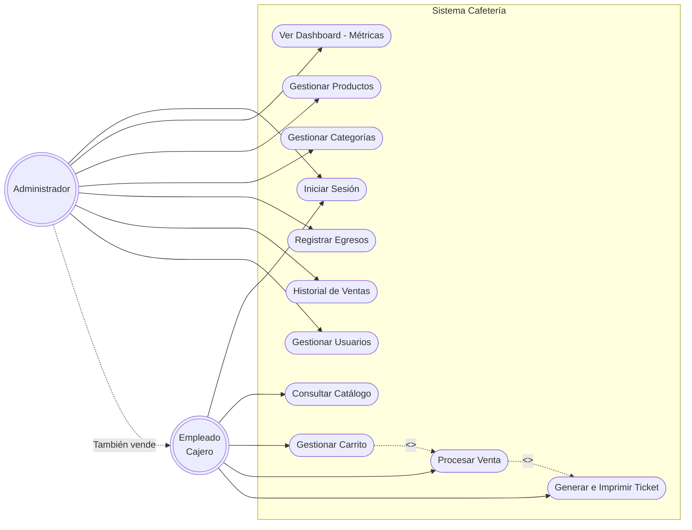

# Diagrama de Casos de Uso - Sistema de Cafetería

A continuación se presenta el diagrama de casos de uso del sistema, modelado bajo la sintaxis de Mermaid. Este diagrama ilustra las interacciones principales entre los diferentes actores (Empleado y Administrador) y el sistema.

## Descripción de los Casos de Uso

**Actor: Empleado**
* **Iniciar Sesión:** Autenticarse en el sistema con sus credenciales.
* **Consultar Catálogo:** Ver la lista de productos disponibles filtrados por categorías.
* **Gestionar Carrito:** Agregar, modificar la cantidad o eliminar productos del pedido actual.
* **Procesar Venta:** Finalizar el cobro del pedido y registrar el ingreso en la base de datos.
* **Generar e Imprimir Ticket:** Acción que se detona automáticamente tras procesar la venta para entregar al cliente.

**Actor: Administrador**
*Incluye todos los permisos del empleado, más:*
* **Ver Dashboard:** Visualizar un resumen gráfico de los ingresos, egresos y productos más vendidos (del día o la semana).
* **Gestionar Productos/Categorías:** Crear, editar, desactivar y administrar precios e imágenes.
* **Registrar Egresos:** Llevar control de gastos (insumos, servicios, etc.).
* **Consultar Historial de Ventas:** Auditar tickets y ventas individuales por fecha.
* **Gestionar Usuarios:** Crear nuevas cuentas para el staff, cambiar contraseñas o roles.
